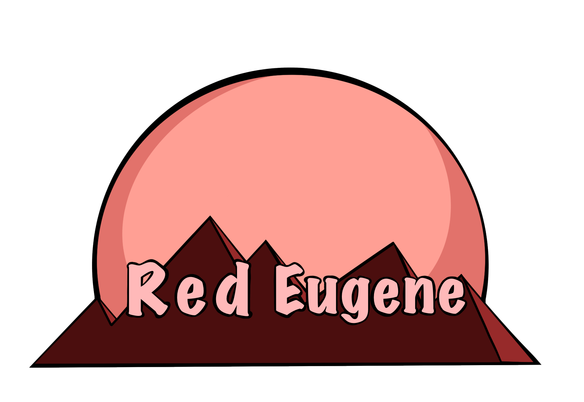

<div align="center">
  <h2>An simple job system based of ScheduledThreadPoolExecutor</h2>
  <hr />
  <a href="https://github.com/mintUI9976/RedEugene"></a>
  <a href="https://github.com/mintUI9976/RedEugene"></a>
  <a href="https://github.com/mintUI9976/RedEugene/blob/master/LICENSE"></a>
  <a href="https://github.com/mintUI9976/RedEugene/stargazers"></a>
  <a href=""></a>
  
  <br />
  <br />
  <a href="https://github.com/mintUI9976/RedEugene/wiki">Wiki</a>
  <span>&nbsp;&nbsp;•&nbsp;&nbsp;</span>
  <a href="https://github.com/mintUI9976/RedEugene/blob/master/LICENSE">License</a>
  <span>&nbsp;&nbsp;•&nbsp;&nbsp;</span>
  <a href="https://github.com/Zyonic-Software">Github</a>
  <br />
  <hr />
</div>
<div align="left">
<h4>Dependencies & Repository:</h4>
<h5>Maven:</h5>

````xml

<repositories>
    <repository>
        <id>gitlab-maven</id>
        <url>https://gitlab.zyonicsoftware.com/api/v4/projects/164/packages/maven</url>
    </repository>
</repositories>

<distributionManagement>
<repository>
    <id>gitlab-maven</id>
    <url>https://gitlab.zyonicsoftware.com/api/v4/projects/164/packages/maven</url>
</repository>

<snapshotRepository>
    <id>gitlab-maven</id>
    <url>https://gitlab.zyonicsoftware.com/api/v4/projects/164/packages/maven</url>
</snapshotRepository>
</distributionManagement>
````

````xml
mvn dependency:get-Dartifact=com.zyonicsoftware.minereaper.redeugene:redeugene:v0.2.6
````

````xml

<dependency>
    <groupId>com.zyonicsoftware.minereaper.redeugene</groupId>
    <artifactId>redeugene</artifactId>
    <version>v0.2.6</version>
</dependency>
````

<h5>Gradle:</h5>

````xml
maven{url'https://gitlab.zyonicsoftware.com/api/v4/projects/164/packages/maven'}
````

````xml
implementation'com.zyonicsoftware.minereaper.redeugene:redeugene:v0.2.6'
````

<hr />

<h4>Project-Prerequisites:</h4>

``JDK 11 or above``

<hr />

<h4>Developer-Prerequisites:</h4>

``You have to make the scalability of your threads by yourself``
<hr />

<h4>Features:</h4>

- none monitoring thread to check or work with your threads(tasks)
- simple implementation
- simple to use
- own simple job system
- custom thread factory
- custom exception handler
- simple runnable reference interface instance
- cached information about your jobs (live and canceled)
- jobs based of scheduler and void executor
- thread pool statistics

<hr />
<h4>Utilization:</h4>

````java
private static final RedEugene redEugene=new RedEugene(yourName,coreSize,deamon,priority);
private final RedEugeneIntroduction redEugeneIntroduction=new RedEugeneIntroduction(redEugene);
private final EugenePoolStatistics eugenePoolStatistics=new EugenePoolStatistics(redEugene);
````

<hr />

<h4>Examples:</h4>

- Example runnable methods
  -> [ExampleMain.java](https://github.com/mintUI9976/RedEugene/blob/master/src/main/java/com/zyonicsoftware/minereaper/example/ExampleMain.java)
- Example pool statistics
  -> [ExampleMain.java](https://github.com/mintUI9976/RedEugene/blob/master/src/main/java/com/zyonicsoftware/minereaper/example/ExampleMain.java)

- RedEugeneSchedulerRunnable custom reference
  -> [ExampleSchedulerRunnable.java](https://github.com/mintUI9976/RedEugene/blob/master/src/main/java/com/zyonicsoftware/minereaper/example/ExampleSchedulerRunnable.java)
- RedEugeneVoidExecutorRunnable custom reference
  -> [ExampleVoidExecutorRunnable.java](https://github.com/mintUI9976/RedEugene/blob/master/src/main/java/com/zyonicsoftware/minereaper/example/ExampleVoidExecutorRunnable.java)

<hr />

<h4>Wiki:</h4>

- [What is an Daemon thread in Java?](https://github.com/mintUI9976/RedEugene/wiki/What-is-an-Daemon-thread-in-Java%3F)
- [What is an EugeneJob?](https://github.com/mintUI9976/RedEugene/wiki/What-is-an-EugeneJob%3F)
- [What is thread priority in Java?](https://github.com/mintUI9976/RedEugene/wiki/What-is-thread-priority-in-Java%3F)

<hr />

</div>


